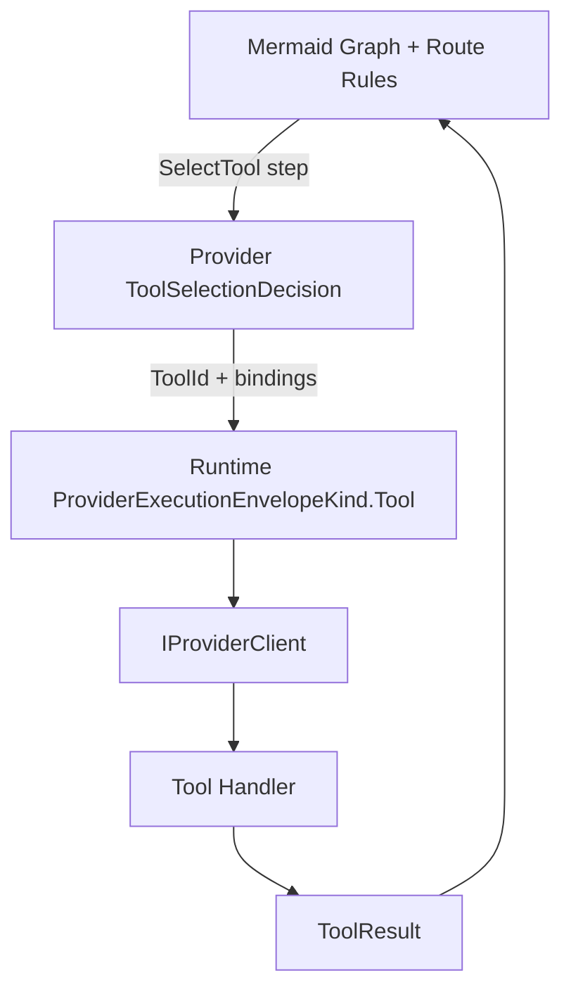

# Tools model: graph routing vs tool selection

Shoots keeps routing and tool execution as separate deterministic concerns:

1. **Mermaid graph and RouteGate decide navigation**
   - Graph nodes, node kinds, and allowed edges define where execution can go next.
   - RouteGate enforces phase/status rules and ownership (for example, `SelectTool` must be AI-owned).
   - `DecisionPolicy` controls whether waiting is allowed, bypass is permitted, or execution halts on missing decisions.

2. **Tool selection decides only tool identity + bindings**
   - Decision providers return `ToolSelectionDecision` with a `ToolId` and argument bindings.
   - Selection does not alter graph connectivity and does not execute tool logic.

3. **Provider execution performs deterministic handler invocation**
   - Runtime emits `ProviderExecutionEnvelopeKind.Tool` with `ToolId` and `Args`.
   - Embedded/Null provider returns `ProviderExecutionResultKind.ToolExecuted`.
   - Tool handler returns contract-shaped `ToolResult` with stable keys and stable error codes.

Golden flow:
- Graph reaches SelectTool node.
- AI decision provider returns `ToolSelectionDecision`.
- Runtime executes tool through provider client.
- Graph advances to terminal node when RouteGate allows.

## How the system actually runs

- Mermaid graph/rules control route structure and allowed transitions.
- Provider decision selects the tool and bindings.
- Tool execution is provider-agnostic and contract-based.
